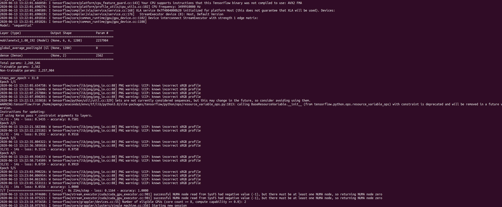
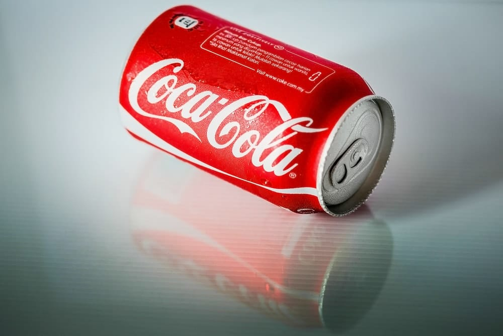
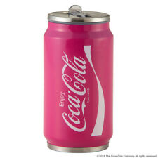
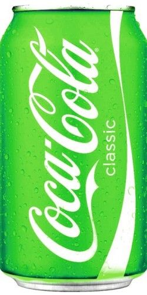
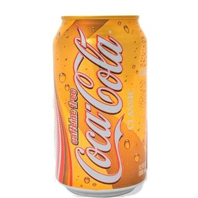
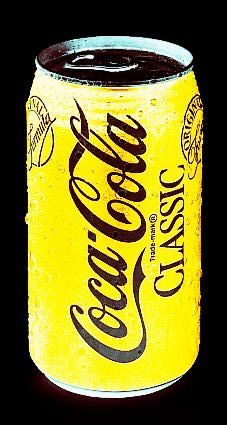
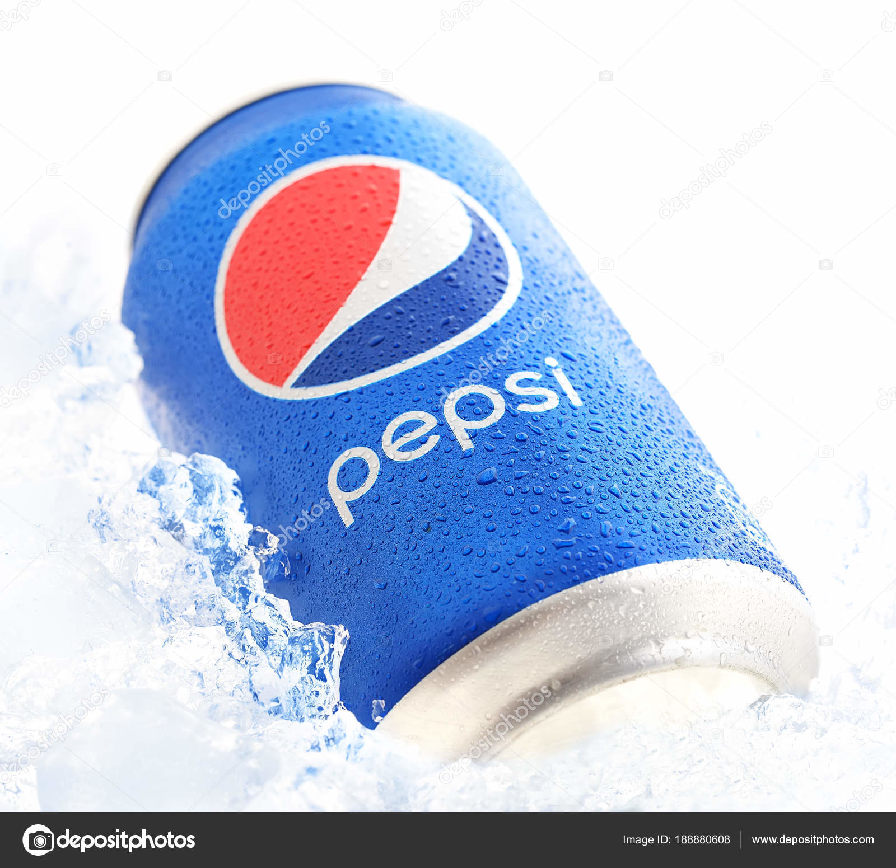
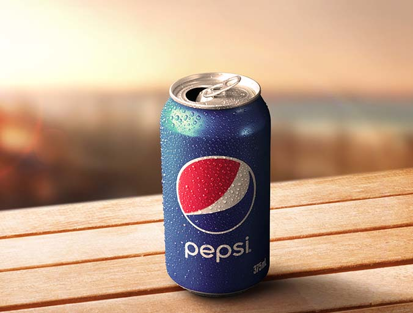
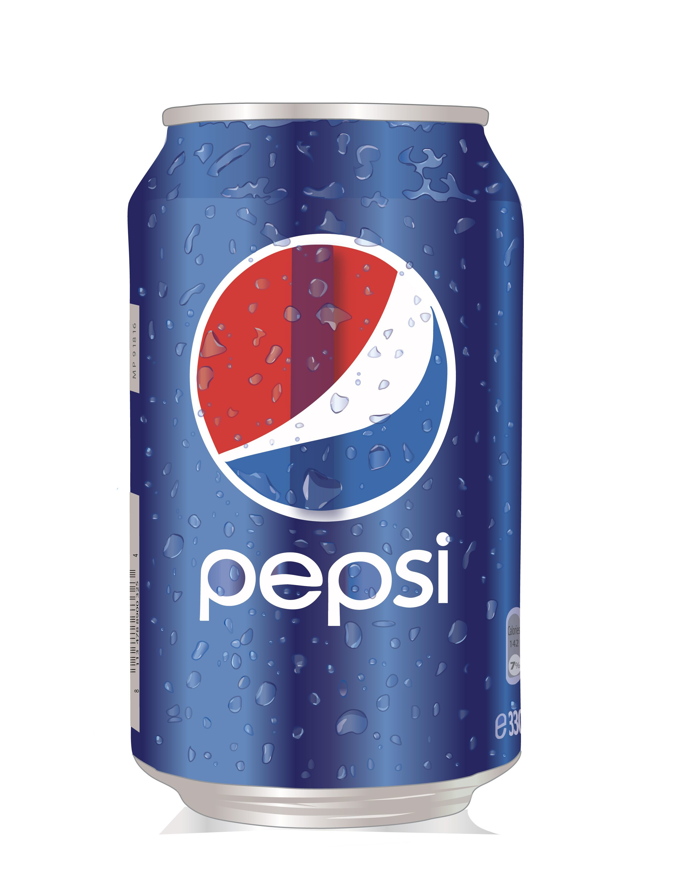
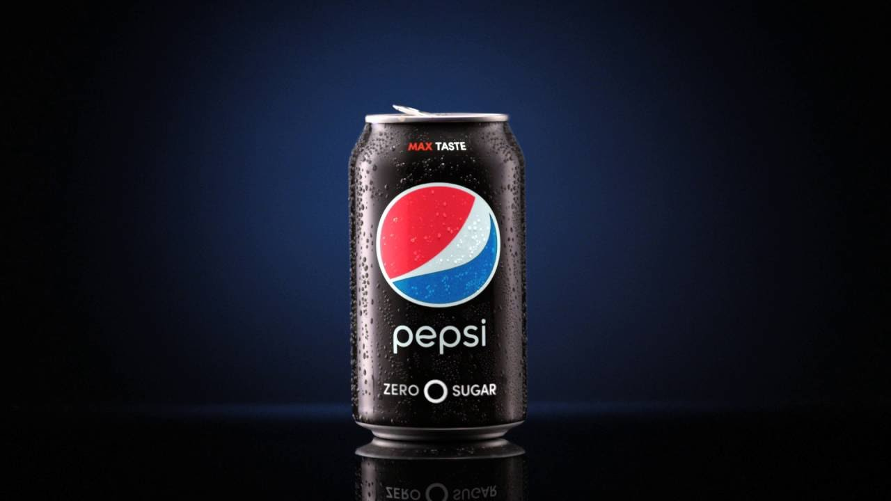

# Visual Defence Homework -- Cocacola, Pepsi can classifier
Cocacola, pepsi can classifier based on MobileNetV2 for Keras and Tensorflow 2.2
## Datasets for trainig and validation
./data/cocacola 74 png  
./data/pepsi 63 png  
124 png are selected for training  
 13 png are selected for validation  
## Dataset for test
./test/test test_00.png, test_01.png, ... test_09.png  
10 png are selected for test  
## Architectures
MobileNetV2(input_shape=(192,192,3), include_top=False)  
    +  
GlobalAveragePooling2D()  
    +  
layers.Dense()  
  
(Note: In order to run on mobile, the network will not be too big. For CPU training, loading pretrained MobileNetV2 will reduce the worklaod)
## Training and validation results
Training: 31 x (batch_size=4, 192, 192, 3) epochs=5  
Validation: 13 x (batch_size=2, 192, 192, 3)  
|  Epoch  | Batch_size |   Loss    | Accuracy |
|:--------|:-----------|:----------|:---------|
|   00    |     4      |0.5435     |0.7581    |
|   01    |     4      |0.1923     |0.9516    |
|   02    |     4      |0.1124     |0.9785    |
|   03    |     4      |0.0795     |0.9919    |
|   04    |     4      |0.0556     |1.0000    |

Validation -loss: 0.1164 -accuracy: 1.0000  

  

## Testing restults
10 Test data, --accuracy: 1.00  

  
Test data from test_00.png to test_04.png
  
  

  
Test data from test_05.png to test_09.png
  
  

